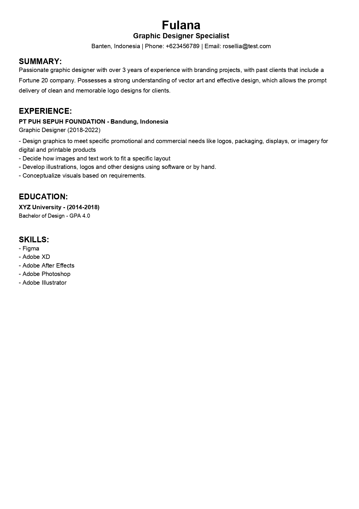

# BUATINCV
 
### CLI CV Builder. Written in Go.


## Table of contents
- [CV Template Design](#cv-template-design)
- [Depedencies that I used](#depedencies-that-i-used)
- [Disclaimer](#disclaimer)
- [Installation](#installation)
- [Usage](#usage)
- [Version Hisory](#version-history)
- [Contributing](#contributing)
- [Testing](#testing)
- [Preview](#preview)
- [To-do list](#to-do-list)
- [License](#license)

## CV Template Design
CV design inspired by https://glints.com/id/lowongan/cv-ats-friendly/ (This article written in Indonesian language)

## Depedencies that I used 
- [Gofpdf](https://github.com/jung-kurt/gofpdf): _A PDF document generator with high level support for text, drawing and images._

- [Cobra](https://github.com/spf13/cobra): _a library for creating powerful modern CLI applications._

## Disclaimer
Based on its documentation, [Gofpdf](https://github.com/jung-kurt/gofpdf) is not being maintained, at least for an unknown duration. However, I haven't encountered any issues when using it. If you have recommendations for alternative PDF Document Generator, feel free to provide suggestions via issues or pull requests.

## Usage
```
[rian@archlinux] ./buatincv
 ```
Simply type "./buatincv" without quotation mark in terminal to get started with.

## Version History
- 1.0.0 
    - Initial Release

## Contributing
- Fork this repo
- Commit changes to your own branch
- Submit a Pull request

Any contribution will be appreciated.

## Testing
Make sure you have cloned this repo. Type the following command to automatically provide input to a prompt:
```
[rian@archlinux bin]$ ./input_test.sh
```
Alternatively, you can type make file which includes the following command (see makefile): 
```
[rian@archlinux bin]$ make test
```

## Preview


## To-do list
- [ ] Multiple Experiences Section
- [ ] Project section.
- [ ] Colored Text. Not necessary but it seems like a good idea.

## License
[](https://opensource.org/licenses/MIT) <br/>
This project is licensed under the MIT License - see the LICENSE.md file for details.